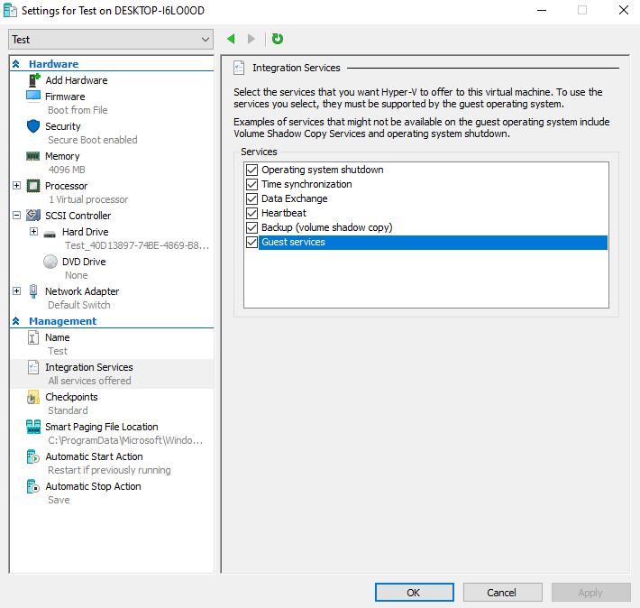
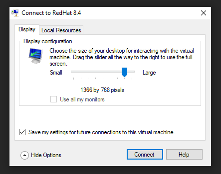
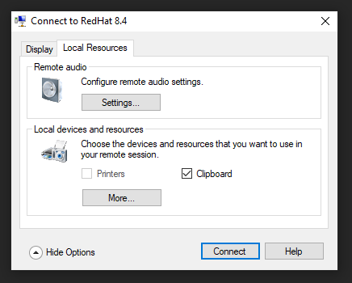
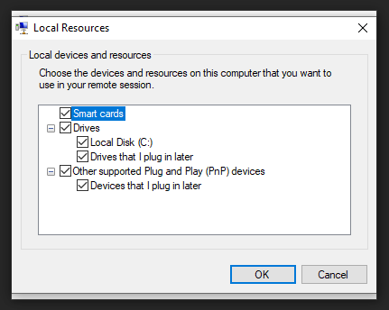
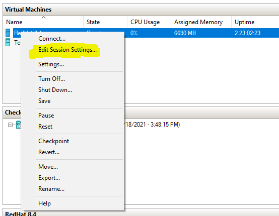

# RedHat Enterprise Linux VM on Hyper-V with Enhanced Session Mode

- RHEL 8
- RHEL 9
- Rocky 8
- Rocky 9
- Fedora 40

## Activate Virtualization in BIOS

The first step to use Hyper-V on your computer is to activate Virtualization in the BIOS.

- On **Intel** platform, option name is `Intel VT-x`
- On **AMD** platform, option name is `AMD-V`

For another platform or if you are facing any troubles, please refer to your computer documentation.

## Activate Hyper-V on Windows 10

To be able to use Hyper-V on Windows 10, you first need to enable it.
To do that, run the following command in **Powershell** as Administrator.

```bash
Enable-WindowsOptionalFeature -Online -FeatureName Microsoft-Hyper-V -All
```

/!\ By enabling Hyper-V you may have difficulties with another **Hypervisor Software** as VirtualBox or VMWare.

You can restart your computer to apply the new configuration.

## Add user to Hyper-V Administrators group

Adding a user to Hyper-V Administrators group is easy and useful.
You will be able to **create / manage / delete / start / stop** VMs without asking Administrators permission.

First, you need to know your **Username** in Windows.
To do that, you can run **Powershell** as user.
Then type the following command and your **Username** will be prompted.

```bash
echo $env:Username
```

Once you know your **Username**, you need to run **Powershell** but as **Administrator** and type de following command by replacing `<USERNAME>` with your **Username**. This will add the user to Hyper-V Administrators group.

For Windows 11 :

```bash
net localgroup "Hyper-V Administrators" "<USERNAME>" /add
```

For previous version of Windows :

```bash
net localgroup "Hyper-V Administrators" "<USERNAME>"
```

You can restart your computer to apply the new configuration.

## Create VM

A dedicated guide provided by RedHat already exists.
Just follow the instructions given by this guide.

The guide is valid for RHEL based distributions and not only RHEL8.

**RedHat guide : [RHEL Hyper-V Quick Install](https://developers.redhat.com/rhel8/install-rhel8-hyperv)**

Please pay attention to `Before you begin` section, point `1` if you want a no-cost Red Hat Developer subscription and the RHEL Binary DVD .iso file.

To have free RedHat developper subscription [RedHat no-cost subscription](https://developers.redhat.com/blog/2021/02/10/how-to-activate-your-no-cost-red-hat-enterprise-linux-subscription#)

RHEL images are available for download on [RedHat Developers Website](https://developers.redhat.com/products/rhel/download)
Rocky Linux images are available for download on [Rocky Linux Website](https://rockylinux.org/download)
Fedora images are available for download on [Fedora Website](https://fedoraproject.org/)

You may install `Rocky Linux 8, Rocky Linux 9 or Fedora` instead of `RHEL 8 or RHEL 9`. In this case, you can follow the same guide and ignore subscription parts.

## Hyper-V Enhanced Session Mode

Enhanced Session Mode allows:
- Better graphical experience (Fluidity and resolution).
- Clipboard support.
- Drives sharing.
- Smart card support.
- Audio support.

To enable Enhanced Session Mode, you need to install and configure `hyperv-tools` and `xrdp` on the VM.

To do that, you can run the dedicated script provided in the current repository. This script is only for RHEL based distributions.

```bash
git clone https://github.com/EtienneBarbier/Hyper-V-RHEL-VM.git
cd Hyper-V-RHEL-VM
chmod +x install_configure_esm_rhel.sh
sudo ./install_configure_esm_rhel.sh
```

Once this script has been executed, you can shut down the VM.

In Hyper-V you need to enable the `Guest services` for your VM. You can find the option under : Click right on VM > `settings` > `Management` > `Integrations Services` >  `Guest services`.



The last step is to set the `EnhancedSessionTransportType` to `HVSocket` for your VM. This can be done by executing the following command line as user in Powershell by replacing `<VM_NAME>` by the name of your VM.

```bash
Set-VM "<VM_NAME>" -EnhancedSessionTransportType HVSocket
```

Now, you can start your VM. After a few moments, you should have the following windows prompted.



You can set your display settings and go to **Local Resources** to modify sound and clipboard settings.



Under more, you have access to **Drives** and **Smart Cards**.



You are done with the settings and you can connect to your VM.
Note that is not possible to connect with a user already connected in another session.

### Sources

[Linux VM Tools from Microsoft on Github](https://github.com/microsoft/linux-vm-tools)

[Enhanced Session Mode from Secana on Github](https://github.com/secana/EnhancedSessionMode)

[XRPD Pipewire module on Github](https://github.com/neutrinolabs/pipewire-module-xrdp)

## Audio (Only for RHEL 8)

Audio is not working by default for RHEL 8. To be able to have VM audio on the host computer, you need to install xrdp module for pulseaudio.

### Prerequisites

Allow 2G of disk space for the mock root in `/var/lib/mock`.

It is assumed that you will be building and installing the package using an existing user account with sudo privileges.

Use these commands to install the mock package, and add the current user to the mock group:

```bash
sudo dnf install mock autoconf automake
sudo usermod -a -G mock $USER
```

Log out and log in again as the current user, and use the `id -Gn` command to check you are on the `mock` group

### Prepare & build pulseaudio

```bash
mkdir xrdp-tmp
cd xrdp-tmp
dnf download --source pulseaudio sbc libatomic_ops webrtc-audio-processing
mock --chain ./sbc-*.src.rpm ./libatomic_ops-*.src.rpm ./webrtc-audio-processing-*.src.rpm ./pulseaudio-*.src.rpm
```

The last command can take a while to execute.

The build is made in a sub-directory of `/var/lib/mock`. This can be fairly deep, so is best located with a `find` command:

<pre><code>find /var/lib/mock -type d -name pulseaudio-\* 2>/dev/null
<b>/var/lib/mock/epel-8-x86_64/root/builddir/build/BUILD/pulseaudio-14.0</b>
</code></pre>

Assign this directory to the environment variable `PULSE_DIR`. On your system, this value may well be different:

```bash
PULSE_DIR=/var/lib/mock/epel-8-x86_64/root/builddir/build/BUILD/pulseaudio-14.0
```

### Build the xrdp module

Finally, let's build xrdp source / sink modules. You'll have two .so files module-xrdp-sink.so and module-xrdp-source.so.

```bash
sudo dnf install make libtool libtool-ltdl-devel pulseaudio-libs-devel git
git clone https://github.com/neutrinolabs/pulseaudio-module-xrdp.git
cd pulseaudio-module-xrdp
./bootstrap && ./configure PULSE_DIR=$PULSE_DIR
make
```

### Install the xrdp module

The last step to install xrdp module is to install module files at the right location. In the same `pulseaudio-module-xrdp` directory from the previous step:

```bash
sudo make install
```

To load xrdp module, you need to add instructions in Pulseaudio configuration file. The following command line will append new instructions at the end of the configuration file.

```bash
sudo tee -a /etc/pulse/default.pa << END
### XRDP modules
.ifexists module-xrdp-sink.so
load-module module-xrdp-sink.so
.endif
.ifexists module-xrdp-source.so
load-module module-xrdp-source.so
.endif
END
```

Due to a Pulseaudio issue and in order to have the right configuration, you need to mask `pulseaudio` service. Pulseaudo will be started at session startup anyway.

The following command line needs to be executed as `user`.

```bash
systemctl --user mask pulseaudio.service
```

To apply the new configuration, you can restart the VM or run the following command:

```bash
pulseaudio -k
```

### Cleaning up

You can clean up the build machine completely if required:

1. Use `mock --clean` to remove the `mock` chroot
2. Delete the xrdp-tmp directory
3. Remove the user from the `mock` group. `sudo gpasswd -d $USER mock`
4. Remove the `mock` RPM. `sudo dnf remove -y mock`

### Sources

[Official sources / documentation](https://github.com/neutrinolabs/pulseaudio-module-xrdp)

[Official Centos 8 build documentation](https://github.com/neutrinolabs/pulseaudio-module-xrdp/wiki/Build-on-CentOS-8.x)

[Pulseaudio issue](https://github.com/neutrinolabs/pulseaudio-module-xrdp/issues/44)


## Reset Enhanced Session Mode Settings

If you want to change Session settings and dedicated windows are not prompted at startup, you can right-click on VM and select `Edit Session Settings`.


